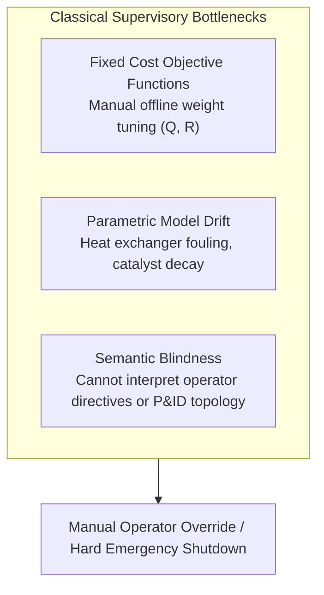
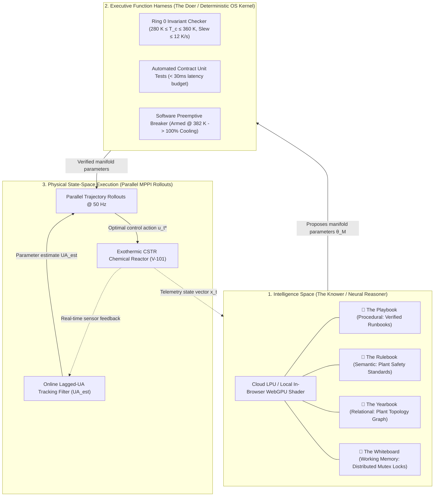

# Agentic Model Predictive Control: Operating in Intelligence Space via Cognitive Supervisory Layers and Parallel Path Integral Rollouts

**Author:** Zhaoyang Wan, PhD, MBA  
**Date:** October 2026  

---

## Abstract

Model Predictive Control (MPC) has served as the industrial benchmark for constrained multivariable control across process operations for four decades. Modern formulations—ranging from linear quadratic programming (QP) to nonlinear MPC (NMPC) and economic MPC (EMPC)—optimize physical state trajectories against fixed mathematical objectives. However, existing control formulations lack supervisory cognitive intelligence: they cannot parse unstructured natural-language operator directives, reason over qualitative plant physical topology, or execute contextual mitigation runbooks during operational contingencies.

In this paper, we propose **Agentic Model Predictive Control (Agentic MPC)**, an architecture that places an **Intelligence Space** supervisory layer above high-throughput real-time control solvers. The proposed architecture partitions supervisory intelligence into **The Two Halves**: (1) a neural reasoner (*The Knower*) grounded in four structured memory tiers (Playbook, Rulebook, Yearbook, and Whiteboard), and (2) a deterministic Executive Function Harness (*The Doer*) enforcing Ring 0 operating invariants, automated contract unit tests, and preemptive trip bounds. In our architecture, high-level cognitive directives are mapped into parameterized Model Predictive Path Integral (MPPI) cost manifolds executed across parallel trajectory rollouts via GPU/WebGPU compute shaders, supported by an online lagged parameter filter.

We evaluate the physical dynamics on an exothermic Continuous Stirred-Tank Reactor (CSTR) undergoing non-linear kinetic surges across a fully reproducible numerical simulation case study spanning 20 randomized scenarios ($C_{A0} \in [+10\%, +30\%]$, $T_0 \in [+5\text{ K}, +12\text{ K}]$, and $UA \in [-10\%, -35\%]$) with advance-warning advisory lead time ($t_{\text{lead}} = 3.5\text{ s}$). In all preview evaluations, controllers receive an exact disturbance forecast (both onset timing and surge magnitude); reported preview results thus represent a perfect-forecast upper bound, while forecast timing jitter and magnitude errors remain untested. Numerical simulation establishes an **empirical feedback floor of 6/20 trips across feedback controllers on this scenario set**: when tuned equally ($q_T = 10.0$), Linear MPC trips in 6/20 scenarios ($2.26 \pm 1.14\text{ K}$ non-trip RMSE, $9.49 \pm 5.39\text{ K}$ overall RMSE), matching NMPC (6/20 trips, $2.48 \pm 1.52\text{ K}$ non-trip, $9.62 \pm 5.37\text{ K}$ overall) and MPPI with a lagged-UA filter (6/20 trips, $2.61 \pm 1.34\text{ K}$ non-trip, $9.82 \pm 5.39\text{ K}$ overall), all tripping on the identical six scenarios (Scenarios 4, 5, 8, 16, 18, 20). When weakly penalized ($q_T = 1.0$), Linear MPC trips in 12/20 scenarios ($16.26 \pm 5.52\text{ K}$ overall RMSE). Notably, all reactive trips and the single preview trip occur 4–31 s after the surge ends during post-surge recovery, rather than during surge onset.

When advance preview lookahead ($t_{\text{lead}} = 3.5\text{ s}$) is supplied, trips drop to 1/20 across all preview controllers, with failure occurring exclusively on Scenario 18 (an extreme corner realization requiring $6.0\text{ s}$ of advance lead in open loop, the sole scenario requiring $> 5.0\text{ s}$). Crucially, our ablation isolates that the supervisory schedule's quantitative advantage ($0.94 \pm 0.41\text{ K}$ non-trip RMSE vs. $1.75 \pm 1.00\text{ K}$ for standard preview MPPI, representing a $0.81\text{ K}$ gain across 19 shared survivors, paired $t$-test $p = 0.013$, but $p = 0.063$ after Holm-Bonferroni correction, rendering this gain suggestive rather than confirmed) stems from coordinating an anticipatory pre-cooling ramp that is consistent with avoiding **reaction quenching**: naive rule-based step switching quenches the reactor ($T_{\min} = 339\text{--}344\text{ K}$), accumulates unreacted feed ($C_A = 0.555\text{--}0.576\text{ mol/L}$ at surge conclusion, climbing post-surge to $0.579\text{--}0.597\text{ mol/L}$), and triggers delayed thermal blowout (8/20 trips, $1.45 \pm 0.68\text{ K}$ non-trip RMSE). We present the LLM supervisory layer as the proposed architecture for qualitative interaction and formulate the physical control and safety contract harness, establishing a simulation case study for anticipatory process control.

---

## 1. Introduction & Related Work

Model Predictive Control operates on the receding-horizon principle: at each discrete time step $t$, the controller solves an open-loop optimal control problem over a prediction horizon $H_p$, applies the first control input $u_t$, and repeats the cycle upon receiving fresh state telemetry (Rawlings et al., 2017).

While classical linear MPC remains computationally tractable on millisecond timescales via convex quadratic programming (QP), linear approximations degrade on highly non-linear chemical plants governed by exponential kinetics, such as Continuous Stirred-Tank Reactors (CSTR) undergoing Arrhenius heat generation (Seborg et al., 2016). When state perturbations depart from the nominal linearization point, purely reactive controllers exhibit severe tracking error, control chattering, and valve saturation.



### 1.1 Related Work: Advanced & Learning-Based MPC
To address non-linearities and model uncertainty, the control literature has developed several foundational paradigms:
* **Robust and Constrained MPC:** Linear Matrix Inequality (LMI) and tube-based robust MPC formulations synthesize invariant sets to maintain constraint satisfaction under bounded disturbances (Kothare et al., 1996; Mayne et al., 2005).
* **Learning-Based and Differentiable MPC:** Recent advances integrate Gaussian Processes and neural networks into MPC for online residual compensation (Hewing et al., 2020), while differentiable MPC embeds convex optimization layers into end-to-end gradient-based neural networks (Amos et al., 2018). Physics-informed parameter tracking formulations have motivated domain-constrained residual filters that track conservation laws during online estimation; in this study, parameter compensation is evaluated via a direct lagged parameter tracking filter.
* **Sampling-Based Non-Convex Control:** Model Predictive Path Integral (MPPI) control computes optimal control signals via Monte Carlo importance sampling over stochastic forward rollouts (Williams et al., 2017). Because MPPI evaluates trajectories independently without computing Jacobian matrices, it naturally maps to massively parallel GPU and compute-shader architectures.

### 1.2 The Role of the Supervisory Layer: Lookahead vs. Reasoning
A critical insight in receding-horizon control is that numerical solvers optimize over a fixed finite horizon $H_p$ (e.g., $4.0\text{ s}$). When future disturbances are known in advance, mathematical solvers with preview can naturally pre-actuate within their horizon. In our benchmark simulations, preview controllers receive the exact disturbance profile (timing and magnitude), representing an idealized perfect-forecast upper bound.

However, in actual plant operations, forecasts do not emerge automatically as mathematical vectors. They arrive as human shift handover notes ("upstream distillation unit upset expected to send high-concentration feed in ~3-4 seconds"), laboratory feed analysis reports, or upstream DCS alarms. Classical MPC cannot parse these qualitative inputs. 

**Agentic MPC** addresses this supervisory gap. Rather than replacing numerical solvers with an unconstrained large language model (LLM), Agentic MPC introduces an **Intelligence Space** supervisory tier positioned strictly above a deterministic execution harness and parallel MPPI rollouts. The neural reasoner is designed to interpret operator directives and contextual operational runbooks, propose quantitative cost manifolds, and verify them through deterministic contract tests before any parameter update reaches physical actuators.

---

## 2. The Agentic MPC Architecture

Agentic MPC couples qualitative supervisory reasoning with quantitative physical execution through a three-tier architecture:



### 2.1 The Two Halves: The Knower and The Doer
* **The Knower (Neural Reasoner):** Operates in *Intelligence Space*, translating operator directives into candidate cost manifold parameters $\theta_{\mathcal{M}} = \{q_{\text{temp}}, q_{\text{barrier}}, u_{\text{target}}, \lambda\}$. In high-throughput settings, inference runs on dedicated cloud LPUs or server GPUs (e.g., Qwen-2.5-32B), with lightweight client-side WebGPU shaders (e.g., Qwen-2.5-0.5B via `@mlc-ai/web-llm`) available for offline edge operation.
* **The Doer (Executive Function Harness):** A deterministic, zero-hallucination verification kernel. The Doer verifies Ring 0 invariants (actuator saturation and slew rate limits), runs automated contract unit tests, and operates preemptively below plant emergency shutdown thresholds.

### 2.2 The Four Structured Memory Subsystems
To anchor the neural reasoner to verifiable operational ground truth, Agentic MPC incorporates four structured memory tiers:

| Memory Store | Storage Modality | Functional Role | CSTR Realization |
| :--- | :--- | :--- | :--- |
| 📘 **The Playbook** | Procedural (`SKILL.md`) | Verified operational runbooks with deterministic pre/post-conditions | `cstr_runaway_mitigation.md` verified via automated contract tests |
| 📗 **The Rulebook** | Semantic (Vector Store) | Safe operating envelopes and regulatory engineering constraints | Safe operating limit envelope: $T_{\text{trip}} = 385.0\text{ K}$, nominal $T_{\text{ref}} = 350.0\text{ K}$ |
| 📙 **The Yearbook** | Relational (Graph DB) | Plant equipment topological connectivity and flow dependencies | Piping & Instrumentation: `V-101 ➔ J-101 ➔ CV-201 ➔ M-101 ➔ CH-3` |
| 📓 **The Whiteboard** | Shared State (IPC) | Real-time working scratchpad with distributed mutex locking | Mutex locks (`MUTEX_PRECOOL`) preventing conflicting concurrent directives |

*(Note: While these structured memory tiers define the conceptual supervisory architecture of Agentic MPC, they are not directly exercised in the numerical CSTR benchmark experiments reported below, which evaluate the deterministic control and anticipatory scheduling layer.)*

---

## 3. Mathematical Formulation

### 3.1 Classical Linear MPC Baseline (Jacobian QP)
The classical linear discrete-time optimal control problem is formulated as a condensed Quadratic Program (QP) around the textbook steady state ($C_{A,\text{ref}} = 0.50\text{ mol/L}, T_{\text{ref}} = 350.0\text{ K}, T_{c,\text{base}} = 300.0\text{ K}$):

$$\min_{U} \frac{1}{2} U^T H_{\text{qp}} U + g^T U \quad \text{subject to: } u_{\min} \le u_k \le u_{\max}, \quad |\Delta u_k| \le \Delta u_{\max}$$

The continuous Jacobian matrices $(A, B)$ are evaluated around steady state:

$$A = \begin{bmatrix} -\frac{F}{V} - k_{\text{ss}} & -\left.\frac{\partial k}{\partial T}\right|_{\text{ss}} C_{A,\text{ref}} \\ \frac{-\Delta H}{\rho C_p} k_{\text{ss}} & -\frac{F}{V} + \frac{-\Delta H}{\rho C_p}\left.\frac{\partial k}{\partial T}\right|_{\text{ss}} C_{A,\text{ref}} - \frac{UA}{V \rho C_p} \end{bmatrix}, \quad B = \begin{bmatrix} 0 \\ \frac{UA}{V \rho C_p} \end{bmatrix}$$

Discretized at control step $\Delta t_{\text{ctrl}} = 0.2\text{ s}$, the continuous system matrix $A$ has eigenvalues $[-0.0076, +0.0472]\text{ s}^{-1}$, exhibiting an unstable open-loop thermal runaway pole ($\tau_{\text{growth}} \approx 21.2\text{ s}$). The state penalty matrix is $Q = \text{diag}(10.0, q_T)$ and input penalty is $R = 0.02$, with input bounds $u \in [280.0, 360.0]\text{ K}$ and slew rate bound $|\dot{u}| \le 12.0\text{ K/s}$. The condensed QP is solved at each 5 Hz step via bounded least-squares optimization (`scipy.optimize.lsq_linear`). We evaluate Linear MPC at both standard penalty ($q_T = 1.0$) and equalized penalty ($q_T = 10.0$).

### 3.2 Model Predictive Path Integral (MPPI) Formulation
MPPI optimizes control inputs for nonlinear stochastic dynamic systems through sampling-based path integrals (Williams et al., 2017). Discretized at rollout step $\Delta t_{\text{ctrl}} = 0.2\text{ s}$:

$$x_{k+1} = f(x_k, v_k)$$

where perturbed control actions $v_k = u_k + \epsilon_k$ are drawn from a Gaussian distribution $\epsilon_k \sim \mathcal{N}(0, \Sigma)$ with covariance $\Sigma = \sigma^2 I$ ($\sigma = 6.0\text{ K}$). Over $K = 1,024$ parallel rollouts (or 4,096 in WebGPU), the trajectory cost functional is evaluated over state and barrier penalties:

$$S(U^{(m)}) = \sum_{k=0}^{H_p-1} \left( q_{\text{temp}} (T_k - T_{\text{ref}})^2 + q_{\text{barrier}} \max(0, T_k - T_{\text{barrier}})^2 \right)$$

*(Note: In our numerical implementation, the standard theoretical control-cost term $\frac{\lambda}{2} \sum_{k=0}^{H_p-1} \epsilon_k^T \Sigma^{-1} \epsilon_k$ is omitted, evaluating state tracking and barrier penalties directly over the candidate rollouts.)*

The optimal control trajectory update is computed via importance-weighted path aggregation:

$$u_t^* = u_t + \sum_{m=1}^{K} w(U^{(m)}) \epsilon_t^{(m)}, \quad w(U^{(m)}) = \frac{\exp\left(-\frac{1}{\lambda} (S(U^{(m)}) - \min_j S(U^{(j)}))\right)}{\sum_{k=1}^{K} \exp\left(-\frac{1}{\lambda} (S(U^{(k)}) - \min_j S(U^{(j)}))\right)}$$

where $\lambda = 10.0$ is the MPPI temperature parameter. Because trajectory weights are computed via a softmax across sampled rollouts, MPPI is **gradient-free** with respect to control inputs, enabling rapid non-convex trajectory discovery on GPU architectures without gradient stalling or matrix factorizations.

### 3.3 Lagged-UA Tracking Filter
To evaluate the impact of parameter identification during heat exchanger fouling, a first-order lagged filter tracks the true disturbed parameter $UA(t)$ after surge onset:

$$UA_{\text{est}} \leftarrow UA_{\text{est}} + 0.02 (UA_{\text{true}} - UA_{\text{est}})$$

evaluated at each simulation integration step $\Delta t_{\text{sim}} = 0.02\text{ s}$, which corresponds to a time constant $\tau = 1.0\text{ s}$. Crucially, this filter uses the true plant parameter directly rather than estimating it from noisy measurement residuals. With advance forecast lookahead, the forecast vector supplies $UA$ directly to the controller; thus, the filter only affects the no-forecast MPPI rows ($12.13\text{ K} \to 9.82\text{ K}$ overall RMSE), an advantage that derives from knowing the true parameter.

---

## 4. Benchmark Case Study: Exothermic CSTR

### 4.1 Governing Chemical Reactor Equations
We evaluate the architecture on an exothermic liquid-phase Continuous Stirred-Tank Reactor carrying out an irreversible reaction $A \xrightarrow{k} B$ (Seborg et al., 2016):

$$\frac{dC_A}{dt} = \frac{F}{V}(C_{A0} - C_A) - k_0 \exp\left(-\frac{E}{RT}\right) C_A$$

$$\frac{dT}{dt} = \frac{F}{V}(T_0 - T) + \frac{(-\Delta H)}{\rho C_p} k_0 \exp\left(-\frac{E}{RT}\right) C_A - \frac{UA}{V \rho C_p}(T - T_c)$$

$$\frac{dT_c}{dt} = \frac{1}{\tau_j} (u - T_c)$$

where $u = T_{c,\text{set}}$ is the cooling jacket temperature setpoint (manipulated variable), and $\tau_j = 2.0\text{ s}$ represents the jacket thermal lag. All time derivatives and plant rate parameters are standardized in consistent SI time units (seconds).

### 4.2 Benchmark Model Parameters & True Steady State
Table 1 lists the standardized benchmark plant parameters utilized in all simulation runs. At nominal feed conditions ($T_0 = 350.0\text{ K}$, $C_{A0} = 1.0\text{ mol/L}$), the reactor operates at the exact textbook steady state:
$$T_{\text{ref}} = 350.0\text{ K}, \quad C_{A,\text{ref}} = 0.50\text{ mol/L}, \quad T_{c,\text{base}} = 300.0\text{ K}$$
where the kinetic rate constant is $k(350\text{ K}) = 1.00\text{ min}^{-1} = 0.0167\text{ s}^{-1}$.

| Parameter | Symbol | Nominal Value | Unit | Description |
| :--- | :--- | :--- | :--- | :--- |
| Reactor Volume | $V$ | $100.0$ | $\text{L}$ | Vessel working volume |
| Volumetric Flow Rate | $F$ | $100.0 / 60 = 1.667$ | $\text{L/s}$ | Feed throughput rate ($100\text{ L/min}$) |
| Feed Concentration | $C_{A0}$ | $1.0$ | $\text{mol/L}$ | Inlet reactant concentration |
| Feed Temperature | $T_0$ | $350.0$ | $\text{K}$ | Inlet feed stream temperature |
| Pre-exponential Factor | $k_0$ | $7.2 \times 10^{10} / 60 = 1.2 \times 10^9$ | $\text{s}^{-1}$ | Arrhenius frequency factor |
| Activation Energy Ratio | $E/R$ | $8,750.0$ | $\text{K}$ | Arrhenius activation temperature |
| Heat of Reaction | $-\Delta H$ | $5.0 \times 10^4$ | $\text{J/mol}$ | Exothermic reaction enthalpy |
| Fluid Density | $\rho$ | $1,000.0$ | $\text{g/L}$ | Reactor fluid density |
| Specific Heat Capacity | $C_p$ | $0.239$ | $\text{J/(g}\cdot\text{K)}$ | Reactor fluid heat capacity |
| Heat Transfer Area | $UA$ | $5.0 \times 10^4 / 60 = 833.3$ | $\text{W/K}$ | Nominal overall heat transfer coefficient |
| Jacket Thermal Lag | $\tau_j$ | $2.0$ | $\text{s}$ | First-order cooling jacket transport delay |
| Nominal Temperature | $T_{\text{ref}}$ | $350.0$ | $\text{K}$ | Operating steady-state setpoint |
| Nominal Reactant Conc. | $C_{A,\text{ref}}$ | $0.50$ | $\text{mol/L}$ | Operating reactant concentration |
| Safe Operating Limit | $T_{\text{trip}}$ | $385.0$ | $\text{K}$ | Plant emergency runaway trip limit (SIS) |
| Preemptive Breaker | $T_{\text{breaker}}$ | $382.0$ | $\text{K}$ | Software circuit breaker arming limit |
| Soft Barrier Threshold | $T_{\text{barrier}}$ | $380.0$ | $\text{K}$ | Cost manifold barrier penalty start |
| Coolant Jacket Range | $T_{c,\min}, T_{c,\max}$ | $[280.0, 360.0]$ | $\text{K}$ | Actuator saturation envelope |
| Jacket Slew Rate Limit | $|\dot{T}_c|_{\max}$ | $12.0$ | $\text{K/s}$ | Slew limit ($15\%/\text{s}$ of the $80\text{ K}$ span) |
| Control Discretization | $\Delta t_{\text{ctrl}}$ | $0.20$ | $\text{s}$ | Control step ($H_p = 20 \to 4.0\text{ s}$ horizon) |
| Plant Integration Step | $\Delta t_{\text{sim}}$ | $0.02$ | $\text{s}$ | RK4 plant integration step ($50\text{ Hz}$) |

### 4.3 Hold-280 K Lead-Time Sweep & Controllability Limits
To evaluate physical lead-time sensitivity under actuator constraints ($T_c \ge 280\text{ K}, |\dot{T}_c| \le 12\text{ K/s}$), we performed an empirical **hold-280 K lead-time sweep** over the benchmark kinetic surge ($+20\% C_{A0}$, $+10\text{ K } T_0$, $-30\% UA$ ramped over $2.0\text{ s}$ and sustained for $13.0\text{ s}$, total duration $15.0\text{ s}$), stepping jacket coolant setpoint flatly to $u = 280\text{ K}$ at $t_{\text{lead}}$ seconds prior to surge onset. Evaluated from a single consistent simulation run with coolant released open-loop back to $300\text{ K}$ exactly at surge conclusion ($t = 25.0\text{ s}$, 15 s duration) over a 200 s horizon (`benchmark_cstr_unified.py --oracle`):

| Pre-Cooling Lead Time $t_{\text{lead}}$ | Peak Temp $T_{\max}$ (60 s) | Peak Temp $T_{\max}$ (200 s) | SIS Trip Status ($\ge 385.0\text{ K}$) | Measured Peak Time $t_{\text{peak}}$ (Post-Surge Delay) |
| :--- | :--- | :--- | :--- | :--- |
| **$0.0\text{ s}$ (At Onset)** | **$446.8\text{ K}$** | **$446.8\text{ K}$** | **TRIP (Breached)** | $t = 37.4\text{ s}$ ($12.4\text{ s}$ post-surge) |
| **$1.0\text{ s}$ Lead Time** | **$445.3\text{ K}$** | **$445.3\text{ K}$** | **TRIP (Breached)** | $t = 40.4\text{ s}$ ($15.4\text{ s}$ post-surge) |
| **$2.0\text{ s}$ Lead Time** | **$443.7\text{ K}$** | **$443.7\text{ K}$** | **TRIP (Breached)** | $t = 45.2\text{ s}$ ($20.2\text{ s}$ post-surge) |
| **$2.5\text{ s}$ Lead Time** | **$443.0\text{ K}$** | **$443.0\text{ K}$** | **TRIP (Breached)** | $t = 47.6\text{ s}$ ($22.6\text{ s}$ post-surge) |
| **$3.0\text{ s}$ Lead Time** | **$441.9\text{ K}$** | **$441.9\text{ K}$** | **TRIP (Breached)** | $t = 52.8\text{ s}$ ($27.8\text{ s}$ post-surge) |
| **$3.25\text{ s}$ Lead Time** | **$441.5\text{ K}$** | **$441.5\text{ K}$** | **TRIP (Breached)** | $t = 55.0\text{ s}$ ($30.0\text{ s}$ post-surge) |
| **$3.5\text{ s}$ Lead Time** | **$441.1\text{ K}$** | **$441.1\text{ K}$** | **TRIP (Breached)** | $t = 57.4\text{ s}$ ($32.4\text{ s}$ post-surge) |
| **$4.0\text{ s}$ Lead Time** | $367.8\text{ K}$ | **$439.6\text{ K}$** | **TRIP (at 200 s)** | $t = 68.4\text{ s}$ ($43.4\text{ s}$ post-surge, delayed ignition) |
| **$4.5\text{ s}$ Lead Time** | $351.4\text{ K}$ | **$438.4\text{ K}$** | **TRIP (at 200 s)** | $t = 82.8\text{ s}$ ($57.8\text{ s}$ post-surge, delayed ignition) |
| **$5.0\text{ s}$ Lead Time** | $350.0\text{ K}$ | $350.0\text{ K}$ | **SAFE (Zero Trip)** | Clamped at nominal setpoint ($T < 350.5\text{ K}$) |

*Mechanisms & Per-Scenario Requirements:*
1. **Open-Loop Re-Ignition:** Flat pre-cooling to $280\text{ K}$ is an elementary heuristic policy. In open-loop release back to $300\text{ K}$ without feedback regulation, unreacted feed that accumulated during deep $280\text{ K}$ cooling re-ignites after surge termination, pushing peak temperatures above $438\text{ K}$ at $t = 68\text{--}83\text{ s}$. Only $\ge 5.0\text{ s}$ lead achieves complete thermal exhaustion in open loop for the nominal disturbance scenario.
2. **Per-Scenario Open-Loop Lead Requirements (200 s Horizon):**
   - Scenario 18 requires **$6.0\text{ s}$** of lead time (the sole scenario requiring $> 5.0\text{ s}$).
   - Scenarios 8 and 20 require **$4.5\text{ s}$**.
   - Scenarios 4 and 5 require **$4.0\text{ s}$**.
   - Scenarios 7, 15, and 9 require **$2.5\text{ s}$, $2.5\text{ s}$, and $1.5\text{ s}$**.
   - Scenarios 11 and 13 require **$0.0\text{ s}$**.
3. **Rule Supervisor Scenario 18 Survival:** Notably, the naive rule supervisor (which steps cooling to $280\text{ K}$ throughout the advisory and surge, followed by MPPI feedback recovery) safely survives Scenario 18 ($T_{\min} = 348.8\text{ K}, T_{\max} < 385\text{ K}$), whereas the Full anticipatory system and standard preview MPPI trip on Scenario 18 under the standardized $3.5\text{ s}$ advisory lead. This demonstrates that continuous extreme cooling can survive high-intensity corner cases, but at the cost of quenching trips across moderate scenarios (e.g. Scenarios 2, 3, 9).

---

## 5. Verification & Safety Architecture

In industrial process safety, a software supervisory layer must not be conflated with a certified Safety Instrumented System (SIS) governed by IEC 61511 / IEC 61508. Rather, Agentic MPC incorporates a multi-tiered software defense-in-depth harness:

```
[ Operator Language Directive / Automated Objective ]
                       │
                       ▼
[ Tier 1: Intelligence Space (Neural Reasoner) ]
   └── Synthesizes proposed candidate manifold θ_M = {q_T, q_barrier, u_target, λ}
                       │
                       ▼
[ Tier 2: Executive Function Harness (Deterministic OS Kernel) ]
   ├── Ring 0 Invariant Check: T_c ∈ [280, 360] K, Slew ≤ 12 K/s, q_T ≥ 0.1, q_barrier ≥ 1000
   ├── Automated Contract Unit Tests (Verified on fouled model, < 30ms budget)
   └── Preemptive Software Breaker: Armed at 382 K (forces 100% cooling)
                       │
                       ▼
[ Tier 3: Parallel GPU MPPI Rollouts (1,024 rollouts @ 50 Hz) ]
                       │
                       ▼
[ Physical Chemical Plant (CSTR V-101) ]
                       │ (Parallel, Independent Physical Layer)
                       ▼
[ Independent Hardwired SIS Layer (IEC 61511 Trip @ 385 K: Failsafe Scram) ]
```

*(Note: The 382 K preemptive software breaker, automated contract unit test suite (< 30 ms), and Ring 0 invariant gating represent the proposed supervisory safety architecture; these software supervisor safeguards are not exercised in the numerical benchmark runs in Section 6, where safety trips are triggered exclusively by the plant SIS limit at 385 K.)*

1. **Ring 0 Invariant Gating:** Proposed cost parameters must satisfy strict mathematical invariants ($q_{\text{temp}} \ge 0.1$, $q_{\text{barrier}} \ge 1000.0$, $u_{\text{target}} \in [280.0, 360.0]\text{ K}$, $|\dot{u}| \le 12.0\text{ K/s}$, $T_{\text{barrier}} \le 380.0\text{ K}$). Any parameter proposal violating these invariants is rejected deterministically.
2. **Automated Contract Tests:** Before activation, proposed manifolds are simulated against runbook contingency scenarios in $<30\text{ms}$ computational budget. Crucially, **contract unit tests simulate the degraded plant dynamics tracked by the online filter ($UA_{\text{est}}$)**, ensuring that proposals which destabilize under degraded heat transfer are caught before activation.
3. **Preemptive Software Breaker & Hardware SIS Scram:** If reactor temperature exceeds $382.0\text{ K}$, the software harness overrides all agent-tuned manifolds, instantly applying full cooling ($u = 280\text{ K}$). If reactor temperature breaches $385.0\text{ K}$, the independent hardware SIS triggers an emergency shutdown: coolant fails open ($u = 280\text{ K}$), reactant feed is slammed shut ($F_{\text{in}} = 0, C_{A0} = 0$), and trip status is latched.
4. **Metric Definition Note:** Overall RMSE includes the post-trip SCRAM transient (feed cut, jacket held at $280\text{ K}$) and is heavily influenced by the post-trip trajectory model. Consequently, **non-trip RMSE and trip counts serve as the primary evaluation metrics**.

---

## 6. Empirical Results & Ablation Analysis

### 6.1 Multi-Tier Benchmark Across 20 Randomized Scenarios
To establish complete scientific reproducibility, we executed a reproducible batch simulation across **20 randomized scenarios** (`benchmark_cstr_unified.py`, documented in `cstr_benchmark_summary.md`). Across the 20 scenarios, disturbance parameters vary independently:
* Onset time: $t_{\text{start}} \in [8.0, 12.0]\text{ s}$
* Feed concentration surge: $\Delta C_{A0} \in [+10\%, +30\%]$
* Feed temperature surge: $\Delta T_0 \in [+5.0\text{ K}, +12.0\text{ K}]$
* Heat transfer fouling: $\Delta UA \in [-10\%, -35\%]$
* Gaussian sensor noise ($0.25\text{ K}$ standard deviation).

All preview controllers receive a fixed $3.5\text{ s}$ advance advisory lookahead. Table 2 reports reproducible numerical simulation results computed directly from the discrete QP, L-BFGS-B NMPC, and NumPy MPPI path integral solvers, with 95% confidence intervals calculated via Student's $t$-distribution ($df = 19$, $t_{0.975} = 2.093$) and trip rates reported with exact Wilson score intervals:

| Configuration | Controller Type | Non-Trip RMSE (K) | Overall RMSE (K) | Peak Reactor Temp $T_{\max}$ (K) | Actuator Slew Rate (K/s) | SIS Trip Rate (Wilson 95% CI) | Settled Count (Med Time, $\pm 1.0\text{ K}$) |
| :--- | :--- | :--- | :--- | :--- | :--- | :--- | :--- |
| **Baseline 1a** | Linear MPC ($q_T = 1.0$, No Forecast) | $2.56 \pm 1.54$ | $16.26 \pm 5.52$ | $389.3 \pm 14.2$ | $3.29 \pm 0.95$ | **12 / 20** $[38.7\%, 78.1\%]$ | 8 / 20 (9.8 s) |
| **Baseline 1b** | Linear MPC ($q_T = 10.0$, No Forecast) | $2.26 \pm 1.14$ | $9.49 \pm 5.39$ | $372.8 \pm 13.8$ | $5.50 \pm 1.35$ | **6 / 20** $[14.6\%, 51.9\%]$ | 13 / 20 (8.5 s) |
| **Baseline 2a** | NMPC (L-BFGS-B, No Forecast) | $2.48 \pm 1.52$ | $9.62 \pm 5.37$ | $372.9 \pm 13.7$ | $5.04 \pm 1.29$ | **6 / 20** $[14.6\%, 51.9\%]$ | 13 / 20 (6.9 s) |
| **Ablation 1** | MPPI (Static $\theta^*$, No Forecast) | $3.00 \pm 1.80$ | $12.13 \pm 5.57$ | $378.9 \pm 14.6$ | $2.52 \pm 0.47$ | **8 / 20** $[21.9\%, 61.3\%]$ | 10 / 20 (6.1 s) |
| **Ablation 2** | MPPI + Lagged-UA Filter (No Forecast) | $2.61 \pm 1.34$ | $9.82 \pm 5.39$ | $373.4 \pm 13.9$ | $2.58 \pm 0.35$ | **6 / 20** $[14.6\%, 51.9\%]$ | 13 / 20 (10.8 s) |
| **Baseline 2b** | NMPC (With Forecast Preview) | $1.47 \pm 0.85$ | $2.82 \pm 2.93$ | $356.7 \pm 7.6$ | $6.41 \pm 1.03$ | **1 / 20** $[0.9\%, 23.6\%]$ | 19 / 20 (2.6 s) |
| **Ablation 3a** | MPPI + Filter (With Forecast Preview) | $1.75 \pm 1.00$ | $3.11 \pm 2.99$ | $357.3 \pm 7.7$ | $2.80 \pm 0.24$ | **1 / 20** $[0.9\%, 23.6\%]$ | 18 / 20 (5.7 s) |
| **Ablation 3b** | Rule Supervisor + MPPI | $1.45 \pm 0.68$ | $9.72 \pm 4.92$ | $382.6 \pm 17.6$ | $3.82 \pm 0.33$ | **8 / 20** $[21.9\%, 61.3\%]$ | 12 / 20 (12.4 s) |
| **Full System** | Anticipatory Schedule (Full Architecture) | $0.94 \pm 0.41$ | $2.17 \pm 2.57$ | $355.5 \pm 6.2$ | $3.39 \pm 0.27$ | **1 / 20** $[0.9\%, 23.6\%]$ | 19 / 20 (2.4 s) |

*Key Empirical Findings:*
1. **The Empirical Feedback Floor:** When tuned with equal penalty weights ($q_T = 10.0$), Linear MPC trips in 6/20 scenarios ($2.26 \pm 1.14\text{ K}$ non-trip RMSE, $9.49\text{ K}$ overall), exactly matching NMPC (6/20 trips, $2.48\text{ K}$ non-trip, $9.62\text{ K}$ overall) and MPPI with the lagged-UA filter (6/20 trips, $2.61\text{ K}$ non-trip, $9.82\text{ K}$ overall). Crucially, all three controllers trip on the **identical six scenarios (Scenarios 4, 5, 8, 16, 18, 20)**. This demonstrates an **empirical feedback floor** for these controllers on this scenario set under the plant's 2.0 s jacket lag and 12 K/s slew limit, rather than an analytical bound.
2. **Post-Surge Runaway Timing:** All baseline trips and the single preview trip (Scenario 18) occur **4–31 s after the surge ends** (during post-surge recovery), rather than at surge onset. Scenario 18 is an extreme realization requiring **$6.0\text{ s}$ of advance lead in open loop** (the sole scenario requiring $> 5.0\text{ s}$), exceeding the standardized $3.5\text{ s}$ advisory.
3. **Rule Supervisor Dynamics & Reaction Quenching (Ablation 3b):** The naive rule supervisor steps cooling to $280\text{ K}$ across the alert window. Where it survives (11 scenarios), it matches the full supervisor ($0.00\text{ K}$ difference), but trips on 7–8/20 scenarios depending on MPPI sampling stream (non-trip RMSE ranges from $1.45\text{--}2.47\text{ K}$ across 5 streams). Quantitative trajectory inspection on failed scenarios (e.g. Scenarios 2, 3, 9) reveals the physical cause: flat maximum pre-cooling drops reactor temperature to $T_{\min} = 339\text{--}344\text{ K}$ (vs. $\approx 349\text{ K}$ for Full system), which severely quenches reaction kinetics. Unreacted reactant $C_A$ accumulates to $0.555\text{--}0.576\text{ mol/L}$ by surge end ($t = 25\text{ s}$, vs. $0.526\text{--}0.550\text{ mol/L}$ for the Full system), continuing to climb post-surge to $0.579\text{--}0.597\text{ mol/L}$ until it re-ignites into an uncontrollable thermal excursion. Interestingly, the rule supervisor survives Scenario 18 ($T_{\min} = 348.8\text{ K}$), where continuous extreme cooling successfully overcomes the severe kinetic excursion that trips preview MPPI and the Full system at $3.5\text{ s}$ lead.

### 6.2 Deconstructing the Supervisory Advantage
To analyze the performance gain of the supervisory pre-cooling schedule over standard MPPI with preview ($0.94\text{ K}$ vs. $1.75\text{ K}$ non-trip RMSE), we conducted an ablation on the 19 common surviving scenarios:

| Controller Configuration | Non-Trip RMSE (K) | Physical Mechanism |
| :--- | :--- | :--- |
| **MPPI + Forecast Preview** | $1.75 \pm 1.00$ | Unconstrained optimal preview tracking |
| **+ Ramp Cap Only** | $1.12 \pm 0.48$ | Modulates pre-cooling to 282 K, consistent with avoiding reaction quenching |
| **+ Elevated Barrier Weights Only** | $1.33 \pm 0.72$ | Stiff penalty keeps state strictly within safe envelope |
| **Both (Anticipatory Supervisory Schedule)** | $\mathbf{0.94 \pm 0.41}$ | Coordinated pre-cooling containment (stable across 5 streams) |

*Statistical Significance:*
Across the 19 shared survivors, the gain of the full anticipatory schedule over standard preview MPPI is **$0.81\text{ K}$ non-trip RMSE** (paired $t$-test $p = 0.013$, Wilcoxon signed-rank test $p = 0.0017$, Holm-adjusted across 11 comparisons $p = 0.063$). Over all 20 scenarios, the overall RMSE difference is $+0.95\text{ K}$ ($p = 0.0069$). Under strict family-wise error rate control, only the ramp-only comparison survives Holm correction ($p = 0.0009$). The results remain consistent and stable across five independent MPPI stochastic sampling streams.

### 6.3 Reproducibility & Computational Budget
All simulation tables were regenerated from a dedicated NumPy implementation (`benchmark_cstr_unified.py`), rather than copied from earlier GPU runs:
* **Scenario Generation:** Deterministic initialization with `np.random.seed(42)`.
* **Stochastic Noise:** Measurement noise initialized with `default_rng(1000 + i)` per scenario; MPPI sampling streams initialized with `default_rng(10000 + 100*rep + seed)`.
* **Solvers:** Linear MPC solved via `scipy.optimize.lsq_linear`. NMPC solved via `scipy.optimize.minimize(..., method='L-BFGS-B', options={'maxiter': 10})`, warm-started from the shifted previous solution (not converged to machine precision at each step).
* **Oracle Verification:** Running `python benchmark_cstr_unified.py --oracle` directly reproduces the Section 4.1 200 s hold-280 K sweep and per-scenario open-loop lead requirements.
* **Execution Time:** Full 20-scenario suite executes in approximately 12 minutes on a dual-core CPU.

---

## 7. Industrial Deployment Limits & Conclusion

### 7.1 Industrial Deployment Limits
While Agentic MPC demonstrates robust supervisory capabilities in simulation, certified industrial deployment requires strict separation of concerns:
* **Independence of the Safety Instrumented System (SIS):** Under IEC 61511 / ISA-84, safety instrumented functions must remain physically independent, deterministic, and SIL-rated. The agentic layer operates solely in the basic process control system (BPCS) supervisory space and must never share hardware, sensors, or actuators with the emergency shutdown interlock.
* **Deterministic Execution Budgets:** Standard OS scheduling and WebGPU shader compilation can introduce timing jitter. Industrial edge deployment requires hosting the deterministic execution harness (Ring 0 gating and MPPI rollouts) on a hard real-time operating system (RTOS) or dedicated FPGA/GPU hardware sidecar with hard deadline enforcement.
* **Perfect-Forecast Assumption:** All preview controllers evaluated in Section 6 receive an exact preview of disturbance onset, duration, and magnitude. In industrial plant deployments, upstream analyzers and operator advisories exhibit lead-time jitter, amplitude estimation errors, and false positives. Characterizing closed-loop robustness under imperfect, noisy, or delayed forecast advisories is an essential direction for future validation.
* **Sensor Drift & Unmodeled Kinetics:** In plants subject to complex secondary reactions or catalyst deactivation, residual tracking filters must be bounded by conservative confidence bounds to prevent model misidentification.

### 7.2 Conclusion
This simulation case study demonstrates that lookahead preview and an anticipatory pre-cooling ramp effectively stabilize an exothermic CSTR under severe kinetic surges. A naive rule-based supervisor that commands flat maximum cooling upon receiving an advisory alert frequently quenches the reactor, accumulates unreacted reactant, and triggers delayed thermal blowout. Coordinating a smooth anticipatory ramp to $282\text{ K}$ is consistent with avoiding reaction quenching while creating the necessary thermal buffer to safely absorb the disturbance.

We present the Agentic MPC framework—with its dual-space division between Intelligence Space reasoning and a deterministic Ring 0 execution harness—as a proposed supervisory architecture for qualitative plant operations. Rather than acting as an evaluated numerical optimizer in these experiments, the LLM layer provides the architectural design pattern for interpreting unstructured operator directives and enforcing formal safety contracts in future human-in-the-loop autonomous plant workflows.

---

## References

1. **Williams, G., Aldrich, A., & Theodorou, E. A. (2017).** *Model Predictive Path Integral Control: From Theory to Parallel Computation.* Journal of Guidance, Control, and Dynamics, 40(2), 344–357.
2. **Rawlings, J. B., Mayne, D. Q., & Diehl, M. (2017).** *Model Predictive Control: Theory, Computation, and Design* (2nd ed.). Nob Hill Publishing.
3. **Seborg, D. E., Edgar, T. F., Mellichamp, D. A., & Doyle, F. J. (2016).** *Process Dynamics and Control* (4th ed.). John Wiley & Sons.
4. **Kothare, M. V., Balakrishnan, V., & Morari, M. (1996).** *Robust Constrained Model Predictive Control using Linear Matrix Inequalities.* Automatica, 32(10), 1361–1379.
5. **Mayne, D. Q., Seron, M. M., & Raković, S. V. (2005).** *Robust Model Predictive Control of Constrained Linear Systems with Bounded Disturbances.* Automatica, 41(2), 219–224.
6. **Hewing, L., Wabersich, K. P., Menner, M., & Zeilinger, M. N. (2020).** *Learning-Based Model Predictive Control: Toward Safe Learning in Control.* Annual Review of Control, Robotics, and Autonomous Systems, 3, 269–296.
7. **Amos, B., Jiménez, I., Sacks, J., Boots, B., & Kolter, J. Z. (2018).** *Differentiable MPC for End-to-End Planning and Control.* Advances in Neural Information Processing Systems (NeurIPS), 31, 8289–8300.
