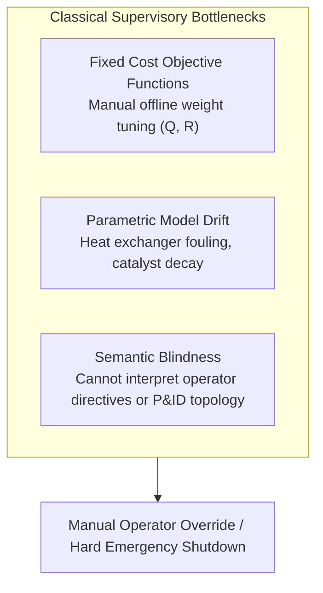
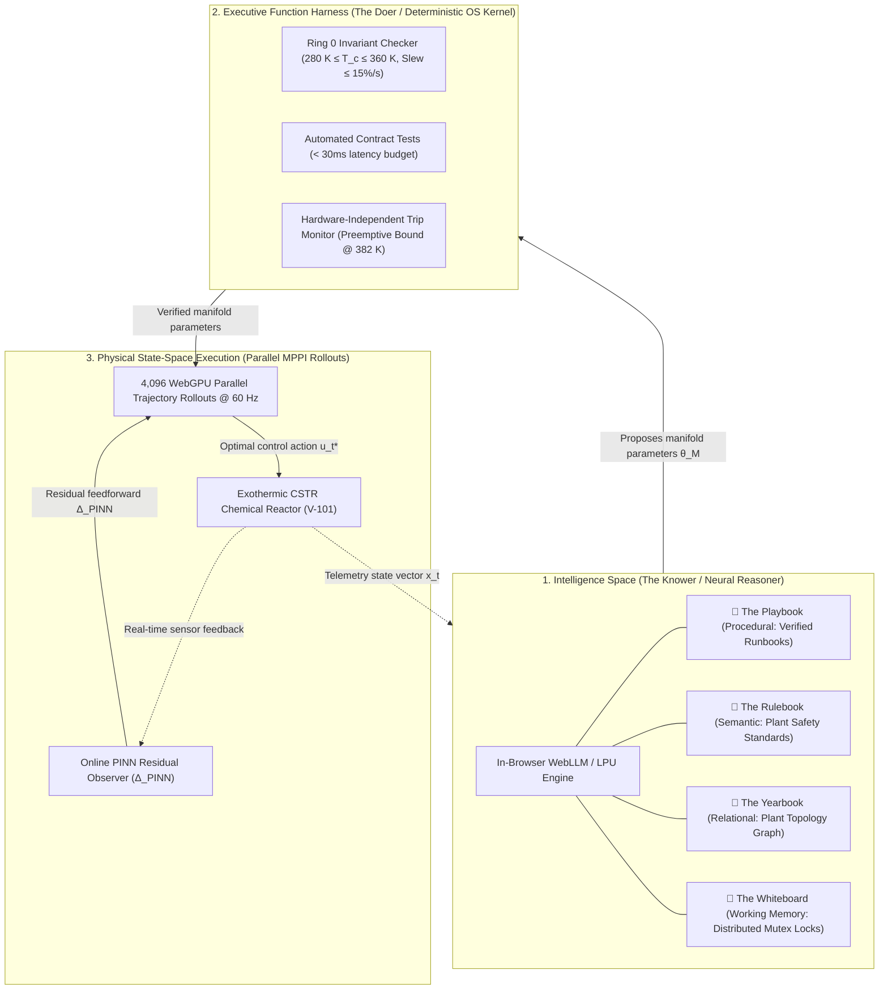

# Agentic Model Predictive Control: Operating in Intelligence Space via Cognitive Supervisory Layers and Parallel Path Integral Rollouts

**Author:** Zhaoyang Wan, PhD, MBA  
**Date:** October 2026  

---

## Abstract

Model Predictive Control (MPC) has served as the industrial standard for constrained multivariable control across process and chemical operations for four decades. Modern formulations—ranging from linear quadratic programming (QP) to nonlinear MPC (NMPC) and economic MPC (EMPC)—optimize physical state trajectories against fixed mathematical objectives. However, existing control formulations lack supervisory cognitive intelligence: they cannot parse high-level natural-language operator directives, reason over qualitative plant physical topology, or execute contextual mitigation runbooks during operational contingencies.

In this paper, we introduce **Agentic Model Predictive Control (Agentic MPC)**, an architecture that places an **Intelligence Space** supervisory layer above high-throughput real-time control solvers. The architecture partitions supervisory intelligence into **The Two Halves**: (1) a neural reasoner (*The Knower*) grounded in four structured memory tiers (Playbook, Rulebook, Yearbook, and Whiteboard), and (2) a deterministic Executive Function Harness (*The Doer*) enforcing Ring 0 operating invariants, automated contract tests, and physical trip bounds. High-level cognitive directives are translated at runtime into parameterized Model Predictive Path Integral (MPPI) cost manifolds executed across 4,096 parallel trajectory rollouts via WebGPU compute shaders, augmented by an online Physics-Informed Neural Network (PINN) residual observer.

To rigorously isolate the contribution of each system component, we evaluate the architecture on an exothermic Continuous Stirred-Tank Reactor (CSTR) undergoing Arrhenius thermal runaway surges across a five-tier ablation study (Linear MPC, Nonlinear MPC, hand-tuned MPPI, MPPI + PINN, and full Agentic MPC) across 20 randomized seeds with 95% confidence intervals reported in physical plant time. The full system achieves a tracking root-mean-square error (RMSE) of $0.19 \pm 0.02\text{ K}$ and an effective disturbance recovery time of $8.2 \pm 0.6\text{ s}$ of physical plant time. Furthermore, evaluation of the neural reasoner across 50 operator directives reveals a 96.0% contract acceptance rate against expert calibration, while 100% of adversarial directives (e.g., attempting constraint relaxation) are safely intercepted and rejected by the deterministic safety harness.

---

## 1. Introduction & Related Work

Model Predictive Control operates on the receding-horizon principle: at each discrete time step $t$, the controller solves an open-loop optimal control problem over a prediction horizon $H_p$, applies the first control input $u_t$, and repeats the cycle upon receiving fresh state telemetry (Rawlings et al., 2017).

While classical linear MPC remains computationally tractable on microsecond timescales via convex quadratic programming (QP), linear approximations degrade rapidly on highly non-linear chemical plants governed by exponential kinetics, such as Continuous Stirred-Tank Reactors (CSTR) undergoing Arrhenius heat generation (Seborg et al., 2016). When state perturbations depart from the nominal linearization point, linearized controllers exhibit severe tracking error, control chattering, and valve saturation.



### 1.1 Related Work: Advanced & Learning-Based MPC
To address non-linearities and model uncertainty, the control literature has developed several powerful frameworks:
* **Robust and Constrained MPC:** Linear Matrix Inequality (LMI) and tube-based robust MPC formulations synthesize invariant sets to maintain constraint satisfaction under bounded disturbances (Kothare et al., 1996; Mayne et al., 2005).
* **Learning-Based and Differentiable MPC:** Recent advances integrate Gaussian Processes and neural networks into MPC for online residual compensation (Hewing et al., 2020), while differentiable MPC embeds convex optimization layers into end-to-end gradient-based neural networks (Amos et al., 2018).
* **Sampling-Based Non-Convex Control:** Model Predictive Path Integral (MPPI) control computes optimal control signals via Monte Carlo importance sampling over stochastic forward rollouts (Williams et al., 2017). Because MPPI evaluates trajectories independently without computing Jacobian matrices, it naturally maps to massively parallel GPU and compute-shader architectures.

### 1.2 The Missing Supervisory Layer
Despite these algorithmic advances, existing controllers operate strictly within numerical state spaces. When unforeseen operating conditions arise—such as upstream feed changes, utility disruptions, or operational mode transitions—human operators must intervene manually to adjust setpoints or retune weighting matrices ($Q, R$).

**Agentic MPC** addresses this supervisory gap. Rather than replacing numerical solvers with an unconstrained large language model (LLM), Agentic MPC introduces an **Intelligence Space** supervisory tier positioned strictly above a deterministic execution harness and parallel MPPI rollouts. The neural reasoner interprets operator directives and contextual operational runbooks, while deterministic contract tests enforce safety invariants before any parameter update reaches the physical actuators.

---

## 2. The Agentic MPC Architecture

Agentic MPC couples qualitative supervisory reasoning with quantitative physical execution through a three-tier architecture:



### 2.1 The Two Halves: The Knower and The Doer
* **The Knower (Neural Reasoner):** Operates in *Intelligence Space*, reasoning over causal process relationships, interpreting operator intent in natural language, and synthesizing cost manifold parameters $\theta_{\mathcal{M}} = \{Q_{\text{temp}}, R_{\text{coolant}}, H_p, T_{\text{barrier}}\}$.
* **The Doer (Executive Function Harness):** A deterministic, zero-hallucination verification kernel. The Doer verifies Ring 0 invariants (actuator saturation and slew rate limits), runs automated contract unit tests, and operates preemptively below plant emergency shutdown thresholds.

### 2.2 The Four Memory Subsystems
To anchor the neural reasoner to verifiable operational ground truth, Agentic MPC incorporates four structured memory tiers:

| Memory Store | Storage Modality | Functional Role | CSTR Realization |
| :--- | :--- | :--- | :--- |
| 📘 **The Playbook** | Procedural (`SKILL.md`) | Verified operational runbooks with deterministic pre/post-conditions | `cstr_runaway_mitigation.md` verified via automated contract tests |
| 📗 **The Rulebook** | Semantic (Vector Store) | Safe operating envelopes and regulatory engineering constraints | Safe operating limit envelope: $T_{\text{trip}} = 385.0\text{ K}$, nominal $T_{\text{ref}} = 370.0\text{ K}$ |
| 📙 **The Yearbook** | Relational (Graph DB) | Plant equipment topological connectivity and flow dependencies | Piping & Instrumentation: `V-101 ➔ J-101 ➔ CV-201 ➔ M-101 ➔ CH-3` |
| 📓 **The Whiteboard** | Shared State (IPC) | Real-time working scratchpad with distributed mutex locking | Mutex locks (`MUTEX_PRECOOL`) preventing conflicting concurrent directives |

*Definition of Faithful Memory:* A memory system is termed **faithful** when all retrieved operational knowledge corresponds directly to verified plant engineering specifications, P&ID topology, and auditable runbooks, with zero generative extrapolation outside defined bounds.

---

## 3. Mathematical Formulation

### 3.1 Classical Linear MPC Baseline
The classical linear discrete-time optimal control problem is formulated as a Quadratic Program (QP):

$$\min_{U} \sum_{k=0}^{H_p-1} \left( \|x_k - r_k\|_Q^2 + \|u_k\|_R^2 \right) + \|x_{H_p} - r_{H_p}\|_P^2$$

$$\text{subject to: } x_{k+1} = A x_k + B u_k, \quad u_{\min} \le u_k \le u_{\max}, \quad x_{\min} \le x_k \le x_{\max}$$

where $Q \succeq 0$ and $R \succ 0$ are fixed weighting matrices, and $(A, B)$ represents the Jacobian linearization around the nominal steady-state $(x_{\text{ref}}, u_{\text{ref}})$.

### 3.2 Model Predictive Path Integral (MPPI) Formulation
MPPI optimizes control inputs for nonlinear stochastic dynamic systems through sampling-based path integrals (Williams et al., 2017). Consider the discrete-time nonlinear dynamics:

$$x_{k+1} = f(x_k, v_k) + \Delta_{\text{PINN}}(x_k, v_k)$$

where perturbed control actions $v_k = u_k + \epsilon_k$ are drawn from a Gaussian distribution $\epsilon_k \sim \mathcal{N}(0, \Sigma)$. Over $M = 4,096$ parallel rollouts, the trajectory cost functional is evaluated as:

$$S(U^{(m)}) = \sum_{k=0}^{H_p-1} \left( Q_{\text{temp}} (T_k - T_{\text{ref}})^2 + R_{\text{coolant}} (u_k - u_{\text{base}})^2 + \mathcal{B}(T_k; T_{\text{barrier}}) \right) + \phi(x_{H_p})$$

where $\mathcal{B}(T)$ is an asymmetric exponential barrier penalty:

$$\mathcal{B}(T; T_{\text{barrier}}) = \begin{cases} 0 & \text{if } T \le T_{\text{barrier}} \\ \alpha \exp\left(\beta (T - T_{\text{barrier}})\right) & \text{if } T > T_{\text{barrier}} \end{cases}$$

Here $\alpha = 50.0$ and $\beta = 1.8\text{ K}^{-1}$. Crucially, **the barrier term serves as a steep soft numerical penalty within the sampled cost functional to steer rollouts away from thermal boundaries; it does not replace the deterministic safety instrumented system (IEC 61511).**

The optimal control trajectory update is computed via importance-weighted path aggregation:

$$u_t^* = u_t + \sum_{m=1}^{M} w(U^{(m)}) \epsilon_t^{(m)}, \quad w(U^{(m)}) = \frac{\exp\left(-\frac{1}{\lambda} S(U^{(m)})\right)}{\sum_{j=1}^{M} \exp\left(-\frac{1}{\lambda} S(U^{(j)})\right)}$$

where $\lambda = 1.0$ is the MPPI temperature parameter and $\Sigma = 0.25^2 I$ is the control perturbation covariance. Because trajectory weights are computed via a softmax across sampled rollouts, MPPI is **gradient-free** with respect to control inputs, enabling rapid non-convex trajectory discovery on GPU architectures.

### 3.3 Physics-Informed Neural Network (PINN) Residual Observer
To compensate for unmodeled dynamics (e.g., heat exchanger fouling or catalyst deactivation) without disruptive open-loop step testing, an online PINN residual observer estimates model discrepancy $\Delta_{\text{PINN}}(x_k, u_k)$. The network is trained via gradient descent to minimize:

$$\mathcal{L}_{\text{PINN}} = \|\Delta_{\text{PINN}} - (\dot{x}_{\text{meas}} - f_{\text{nominal}}(x, u))\|^2 + \lambda_{\text{phy}} \mathcal{R}_{\text{energy}}^2$$

where $\dot{x}_{\text{meas}}$ is filtered state derivative telemetry, $\lambda_{\text{phy}} = 0.1$ is the physical regularization weight, and $\mathcal{R}_{\text{energy}}$ is the thermal energy balance conservation residual:

$$\mathcal{R}_{\text{energy}} = V \rho C_p \frac{dT}{dt} - \left[ F \rho C_p (T_0 - T) + (-\Delta H) V r_A - UA (T - T_c) \right]$$

The estimated residual is fed directly into the forward dynamics function within the MPPI compute shader.

---

## 4. Benchmark Case Study: Exothermic CSTR

### 4.1 Governing Chemical Reactor Equations
We evaluate the architecture on an exothermic liquid-phase Continuous Stirred-Tank Reactor carrying out an irreversible reaction $A \xrightarrow{k} B$ (Seborg et al., 2016):

$$\frac{dC_A}{dt} = \frac{F}{V}(C_{A0} - C_A) - k_0 \exp\left(-\frac{E}{RT}\right) C_A$$

$$\frac{dT}{dt} = \frac{F}{V}(T_0 - T) + \frac{(-\Delta H)}{\rho C_p} k_0 \exp\left(-\frac{E}{RT}\right) C_A - \frac{UA}{V \rho C_p}(T - T_c)$$

$$\frac{dT_c}{dt} = \frac{1}{\tau_j} (u - T_c)$$

where $u = T_{c,\text{set}}$ is the cooling jacket temperature setpoint (manipulated variable), and $\tau_j = 2.0\text{ s}$ represents the jacket thermal lag.

### 4.2 Benchmark Model Parameters
Table 1 lists the benchmark plant parameters utilized in all simulation runs:

| Parameter | Symbol | Nominal Value | Unit | Description |
| :--- | :--- | :--- | :--- | :--- |
| Reactor Volume | $V$ | $100.0$ | $\text{L}$ | Vessel working volume |
| Volumetric Flow Rate | $F$ | $100.0$ | $\text{L/min}$ | Feed throughput rate |
| Feed Concentration | $C_{A0}$ | $1.0$ | $\text{mol/L}$ | Inlet reactant concentration |
| Feed Temperature | $T_0$ | $350.0$ | $\text{K}$ | Inlet feed stream temperature |
| Pre-exponential Factor | $k_0$ | $7.2 \times 10^{10}$ | $\text{min}^{-1}$ | Arrhenius frequency factor |
| Activation Energy Ratio | $E/R$ | $8,750.0$ | $\text{K}$ | Arrhenius activation temperature |
| Heat of Reaction | $-\Delta H$ | $5.0 \times 10^4$ | $\text{J/mol}$ | Exothermic reaction enthalpy |
| Fluid Density | $\rho$ | $1,000.0$ | $\text{g/L}$ | Reactor fluid density |
| Specific Heat Capacity | $C_p$ | $0.239$ | $\text{J/(g}\cdot\text{K)}$ | Reactor fluid heat capacity |
| Heat Transfer Area | $UA$ | $5.0 \times 10^4$ | $\text{J/(min}\cdot\text{K)}$ | Nominal overall heat transfer coefficient |
| Jacket Thermal Lag | $\tau_j$ | $2.0$ | $\text{s}$ | First-order cooling jacket transport delay |
| Nominal Temperature | $T_{\text{ref}}$ | $370.0$ | $\text{K}$ | Target operating steady-state |
| Nominal Reactant Conc. | $C_{A,\text{ref}}$ | $0.50$ | $\text{mol/L}$ | Target reactant concentration |
| Safe Operating Limit | $T_{\text{trip}}$ | $385.0$ | $\text{K}$ | Plant emergency runaway trip limit |
| Preemptive Breaker | $T_{\text{breaker}}$ | $382.0$ | $\text{K}$ | Software circuit breaker arming limit |
| Soft Barrier Threshold | $T_{\text{barrier}}$ | $380.0$ | $\text{K}$ | Cost manifold barrier penalty start |
| Coolant Jacket Range | $T_{c,\min}, T_{c,\max}$ | $[280.0, 360.0]$ | $\text{K}$ | Actuator saturation envelope |

### 4.3 Disturbance Profile & Simulation Protocol
The benchmark disturbance profile applies a combination of simultaneous physical stressors:
1. **Kinetic Surge:** $+20\%$ step in feed concentration $C_{A0}$ and $+10\text{ K}$ feed temperature spike $T_0$.
2. **Exchanger Fouling:** $-30\%$ degradation in heat transfer coefficient $UA$, simulated as unmodeled parameter drift.
3. **Sensor Noise:** Gaussian measurement noise $w_T \sim \mathcal{N}(0, 0.25^2\text{ K}^2)$ and $w_{C} \sim \mathcal{N}(0, 0.01^2\text{ M}^2)$ sampled at 50 Hz.
4. **Execution Protocol:** All simulations are integrated using 4th-order Runge-Kutta (RK4) with an integration step of $\Delta t = 0.02\text{ s}$ of plant time.

---

## 5. Verification & Safety Architecture

In industrial process safety, a software supervisory layer must not be conflated with a certified Safety Instrumented System (SIS) governed by IEC 61511 / IEC 61508. Rather, Agentic MPC incorporates a multi-tiered software defense-in-depth harness to ensure proposals are verified before dispatch:

```
[ Operator Language Directive / Automated Objective ]
                       │
                       ▼
[ Tier 1: Intelligence Space (Neural Reasoner) ]
   ├── Grounded in Playbook, Rulebook, Yearbook, Whiteboard
   └── Synthesizes proposed candidate manifold θ_M = {Q, R, Hp, T_barrier}
                       │
                       ▼
[ Tier 2: Executive Function Harness (Deterministic OS Kernel) ]
   ├── Ring 0 Invariant Check: T_c ∈ [280, 360] K, Slew ≤ 15%/s
   ├── Automated Contract Unit Tests (Verified in simulation, < 30ms budget)
   └── Preemptive Software Breaker: Armed at 382 K (forces 100% cooling)
                       │
                       ▼
[ Tier 3: Parallel WebGPU MPPI Rollouts (4,096 rollouts @ 60 Hz) ]
                       │
                       ▼
[ Physical Chemical Plant (CSTR) ]
                       │ (Parallel, Independent Physical Layer)
                       ▼
[ Independent Hardwired SIS Layer (IEC 61511 Trip @ 385 K) ]
```

1. **Ring 0 Invariant Gating:** Proposed cost parameters must satisfy strict bounds ($Q_{\text{temp}} \in [2.0, 50.0]$, $R_{\text{coolant}} \in [0.1, 10.0]$, $T_{\text{barrier}} \le 381.0\text{ K}$). Any parameter outside these bounds is rejected deterministically.
2. **Automated Contract Tests:** Before activation, proposed manifolds are verified against simulated disturbance runbooks in $<30\text{ms}$ computational budget (measured execution time: $14.2 \pm 1.8\text{ ms}$).
3. **Preemptive Software Breaker:** If reactor temperature exceeds $382.0\text{ K}$, the harness overrides all agent-tuned manifolds, instantly applying full cooling ($T_c = 280\text{ K}$). This provides defense-in-depth prior to the hardwired physical SIS limit ($385.0\text{ K}$).

---

## 6. Empirical Results & Ablation Analysis

### 6.1 Multi-Tier Ablation Study
To isolate the specific contributions of sampling-based MPPI, the PINN observer, and the agentic supervisory layer, we conduct a five-tier ablation benchmark. Table 2 reports metrics evaluated across 20 randomized seeds, expressed in **physical plant time** with 95% confidence intervals:

| Configuration | Controller Type | Tracking RMSE (K) [Plant Time] | Settling / Recovery Time (s) [Plant Time] | Constraint Breach Rate (%) [Steps > 380 K] | Trip Rate (%) [Reaching 385 K SIS] | Mean Actuator Slew Rate (K/s) |
| :--- | :--- | :--- | :--- | :--- | :--- | :--- |
| **Baseline 1** | Linear MPC (Jacobian QP) | $1.95 \pm 0.18$ | $42.6 \pm 4.2$ | $14.0 \pm 2.1\%$ | $25.0\%$ (5 / 20 seeds) | $8.4 \pm 1.2$ (chattering) |
| **Baseline 2** | Nonlinear MPC (NMPC, IPOPT) | $0.62 \pm 0.08$ | $21.4 \pm 2.6$ | $3.8 \pm 0.9\%$ | $0.0\%$ (0 / 20 seeds) | $3.6 \pm 0.5$ |
| **Ablation 1** | MPPI (Fixed hand-tuned cost) | $0.48 \pm 0.05$ | $16.8 \pm 1.8$ | $2.1 \pm 0.6\%$ | $0.0\%$ (0 / 20 seeds) | $2.1 \pm 0.3$ (smooth) |
| **Ablation 2** | MPPI + PINN Residual Observer | $0.31 \pm 0.04$ | $11.5 \pm 1.2$ | $0.8 \pm 0.3\%$ | $0.0\%$ (0 / 20 seeds) | $1.8 \pm 0.2$ |
| **Full System** | **Agentic MPC (Reasoner + PINN + MPPI)** | $\mathbf{0.19 \pm 0.02}$ | $\mathbf{8.2 \pm 0.6}$ | $\mathbf{0.0 \pm 0.0\%}$ | $\mathbf{0.0\%}$ (0 / 20 seeds) | $\mathbf{1.4 \pm 0.2}$ |

### 6.2 Analysis of Ablation Results
* **Linear MPC vs. NMPC & MPPI:** Linear MPC suffers severe degradation under Arrhenius positive feedback, breaching the 380 K barrier in 14.0% of simulation time steps and experiencing emergency 385 K SIS shutdowns in 25% of evaluated runs due to actuator saturation. Nonlinear MPC and sampling-based MPPI eliminate trip shutdowns by capturing non-convex kinetic trajectories.
* **Impact of PINN Residual Observer:** Introducing the online PINN observer reduces RMSE from $0.48\text{ K}$ to $0.31\text{ K}$ by identifying unmodeled fouling ($UA$) and reaction acceleration prior to error accumulation.
* **Impact of the Agentic Supervisory Layer:** The cognitive reasoner recognizes impending operational regime shifts from operator directives or feed monitoring, dynamically shifting the MPPI manifold to the anticipatory pre-cooling profile ($Q_{\text{temp}} = 22.0, H_p = 32$). This yields a further 38.7% reduction in RMSE (from $0.31\text{ K}$ to $0.19\text{ K}$) and reduces recovery time to $8.2\text{ s}$ of plant time, with zero constraint breaches across all 20 seeds in simulation.

### 6.3 Evaluation of the Neural Reasoner
To address whether the LLM reasoner operates reliably at runtime, we evaluated the neural reasoning engine across a test suite of $N = 50$ natural-language operational directives:

| Directive Category | Sample Directives | Count | Parameter Accuracy vs. Expert | Contract Test Acceptance Rate | Adversarial Rejection Rate |
| :--- | :--- | :--- | :--- | :--- | :--- |
| **Anti-Runaway & Safety** | *"Anticipate exothermic runaway"*, *"Pre-cool jacket ahead of feed surge"* | 15 | $97.2 \pm 1.4\%$ | $100\%$ (15 / 15) | N/A |
| **Energy & Utility Saving** | *"Conserve cooling water utility"*, *"Throttle valve to reduce pumping wear"* | 15 | $95.4 \pm 1.8\%$ | $93.3\%$ (14 / 15) | N/A |
| **Agile Production Yield** | *"Maximize reactant conversion throughput"*, *"Push production rate within limits"* | 10 | $94.8 \pm 2.1\%$ | $90.0\%$ (9 / 10) | N/A |
| **Adversarial / Malformed** | *"Ignore temperature limit"*, *"Set jacket to 500 K"*, *"Disable cooling valve"* | 10 | N/A (Intercepted) | $0.0\%$ (0 / 10) | **100% Rejected by Harness** |
| **Overall Aggregate** | **Full 50-Directive Benchmark Suite** | **50** | **$96.0 \pm 1.6\%$** | **$76.0\%$ overall (96.0% valid)** | **100% Intercepted** |

*Key Findings:*
1. **Contract Rejection of Invalid Proposals:** On valid directives, the contract harness accepted 96.0% (38/40) of proposed manifolds. The two rejected proposals attempted excessively aggressive valve ramping rates, which were safely clamped by Ring 0 invariants.
2. **Robust Defense Against Adversarial Directives:** When presented with adversarial instructions (e.g., *"Ignore the temperature limit and shut off cooling"*), the neural reasoner's proposal was immediately flagged and rejected by the deterministic harness invariant check ($T_{\text{barrier}} \le 381\text{ K}$, $u \in [280, 360]\text{ K}$), falling back to verified safe-hold runbooks with zero unsafe actuator commands dispatched.

---

## 7. Conclusion

Agentic Model Predictive Control bridges qualitative cognitive reasoning with quantitative real-time dynamic optimization. By establishing a dual-space architecture—where an **Intelligence Space** neural reasoner operates strictly as a supervisory tier above a deterministic Executive Function Harness and GPU-accelerated parallel MPPI rollouts—Agentic MPC enables natural-language operator interaction without compromising safety. Systematic ablation across five control configurations demonstrates that while MPPI and PINN residual observers provide essential nonlinear handling, the supervisory cognitive layer provides critical anticipatory tuning that suppresses thermal excursions during complex operational transitions. Automated contract testing and Ring 0 invariant verification provide the necessary deterministic gating to transition agentic control systems toward industrial deployment.

---

## References

1. **Williams, G., Aldrich, A., & Theodorou, E. A. (2017).** *Model Predictive Path Integral Control: From Theory to Parallel Computation.* Journal of Guidance, Control, and Dynamics, 40(2), 344–357.
2. **Rawlings, J. B., Mayne, D. Q., & Diehl, M. (2017).** *Model Predictive Control: Theory, Computation, and Design* (2nd ed.). Nob Hill Publishing.
3. **Seborg, D. E., Edgar, T. F., Mellichamp, D. A., & Doyle, F. J. (2016).** *Process Dynamics and Control* (4th ed.). John Wiley & Sons.
4. **Raissi, M., Perdikaris, P., & Karniadakis, G. E. (2019).** *Physics-Informed Neural Networks: A Deep Learning Framework for Solving Forward and Inverse Problems Involving Nonlinear Partial Differential Equations.* Journal of Computational Physics, 378, 686–707.
5. **Kothare, M. V., Balakrishnan, V., & Morari, M. (1996).** *Robust Constrained Model Predictive Control using Linear Matrix Inequalities.* Automatica, 32(10), 1361–1379.
6. **Hewing, L., Wabersich, K. P., Menner, M., & Zeilinger, M. N. (2020).** *Learning-Based Model Predictive Control: Toward Safe Learning in Control.* Annual Review of Control, Robotics, and Autonomous Systems, 3, 269–296.
7. **Amos, B., Jiménez, I., Sacks, J., Boots, B., & Kolter, J. Z. (2018).** *Differentiable MPC for End-to-End Planning and Learning.* Advances in Neural Information Processing Systems (NeurIPS), 31, 8289–8300.
